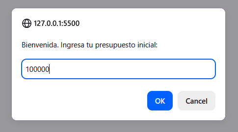
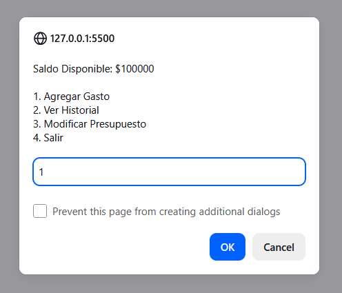
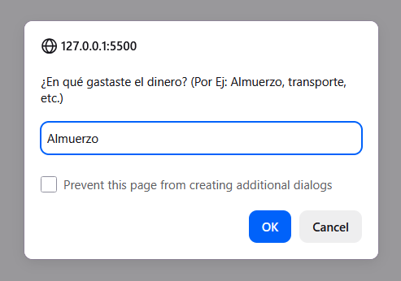
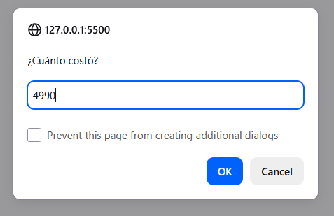
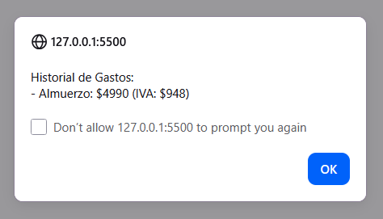
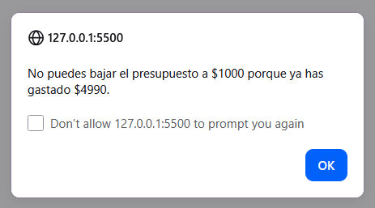

# Proyecto: Aplicación de Consola - Calculadora de gastos

En un principio había pensado en hacer una aplicación orientada a veterinaria, más relacionada con mi carrera. pero opté por una calculadora universal que pudiera servir para cualquier persona que quiere llevar un registro de sus gastos, además que se relaciona con los dos proyectos pasados. La aplicación funciona ejecutando `index.html` y contiene:

- **Botón para iniciar la calculadora**
- **Ventanas emergentes interactivas**
- - Creación/modificación de presupuesto inicia
  - Registro de gastos
  - Calculadora de IVA integrada dentro de los gastos
- **Persistencia de datos** con  `localStorage`

---

## Conceptos de JavaScript Aplicados

Para este proyecto se implementaron los siguientes fundamentos del lenguaje:

* **Variables y tipos de datos:** Uso de `let` y `const` para manejar estados y tipos de datos (strings, numbers, booleans, arrays y objetos).
* **Estructuras de Control:**
  * **Condicionales (`if/else`):** Para la validación de montos y el control de límites de presupuesto.
  * **Switch:** Para la navegación eficiente dentro del menú de opciones.
* **Bucles e iteradores:**
  * **While:** Mantiene la aplicación activa hasta que el usuario decide salir.
  * **forEach:** Recorre el arreglo de gastos para generar el reporte visual del historial.
* **Funciones modularizadas**
* **Estructuras de datos con:**
  * **Objetos:** Cada gasto se almacena como un objeto con múltiples propiedades (`id`, `descripcion`, `monto`, `iva`).
  * **Arreglos:** Los objetos se gestionan dentro de una lista global dinámica.
* **Web APIs:** Integración de `localStorage` para persistencia y `DOM Events` para el manejo del botón de inicio.

---

## Demo

# Calculadora-Gastos
